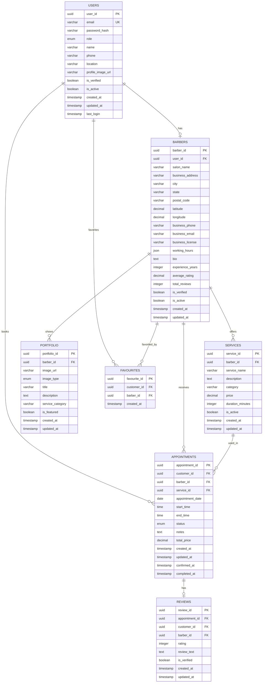

# BarberMatch Database System - Entity Relationship Diagram (ERD)

**Project:** BarberMatch MVP Booking Platform  
**Prepared by:** Shi Ni Lai  
**Date:** 24 October 2025

---

## **ERD Overview**

The Entity Relationship Diagram shows the relationships between all entities in the BarberMatch database system, including primary keys, foreign keys, and cardinality constraints.

---

## **Entity Definitions**

### **1. USERS Entity**
```
USERS
├── user_id (PK) - UUID, Auto-generated
├── email - VARCHAR(255), Unique, Not Null
├── password_hash - VARCHAR(255), Not Null
├── role - ENUM('customer', 'barber'), Not Null
├── name - VARCHAR(100), Not Null
├── phone - VARCHAR(20), Not Null
├── location - VARCHAR(255), Not Null
├── profile_image_url - VARCHAR(500), Nullable
├── is_verified - BOOLEAN, Default: false
├── is_active - BOOLEAN, Default: true
├── created_at - TIMESTAMP, Auto-generated
├── updated_at - TIMESTAMP, Auto-updated
└── last_login - TIMESTAMP, Nullable
```

### **2. BARBERS Entity**
```
BARBERS
├── barber_id (PK) - UUID, Auto-generated
├── user_id (FK) - UUID, References users.user_id
├── salon_name - VARCHAR(100), Not Null
├── business_address - VARCHAR(255), Not Null
├── city - VARCHAR(50), Not Null
├── state - VARCHAR(50), Not Null
├── postal_code - VARCHAR(20), Not Null
├── latitude - DECIMAL(10,8), Nullable
├── longitude - DECIMAL(11,8), Nullable
├── business_phone - VARCHAR(20), Not Null
├── business_email - VARCHAR(255), Nullable
├── business_license - VARCHAR(100), Nullable
├── working_hours - JSON, Not Null
├── bio - TEXT, Nullable
├── experience_years - INTEGER, Default: 0
├── average_rating - DECIMAL(3,2), Default: 0.00
├── total_reviews - INTEGER, Default: 0
├── is_verified - BOOLEAN, Default: false
├── is_active - BOOLEAN, Default: true
├── created_at - TIMESTAMP, Auto-generated
└── updated_at - TIMESTAMP, Auto-updated
```

### **3. SERVICES Entity**
```
SERVICES
├── service_id (PK) - UUID, Auto-generated
├── barber_id (FK) - UUID, References barbers.barber_id
├── service_name - VARCHAR(100), Not Null
├── description - TEXT, Nullable
├── category - VARCHAR(50), Not Null
├── price - DECIMAL(10,2), Not Null
├── duration_minutes - INTEGER, Not Null
├── is_active - BOOLEAN, Default: true
├── created_at - TIMESTAMP, Auto-generated
└── updated_at - TIMESTAMP, Auto-updated
```

### **4. APPOINTMENTS Entity**
```
APPOINTMENTS
├── appointment_id (PK) - UUID, Auto-generated
├── customer_id (FK) - UUID, References users.user_id
├── barber_id (FK) - UUID, References barbers.barber_id
├── service_id (FK) - UUID, References services.service_id
├── appointment_date - DATE, Not Null
├── start_time - TIME, Not Null
├── end_time - TIME, Not Null
├── status - ENUM('requested', 'confirmed', 'rejected', 'cancelled', 'completed'), Default: 'requested'
├── notes - TEXT, Nullable
├── total_price - DECIMAL(10,2), Not Null
├── created_at - TIMESTAMP, Auto-generated
├── updated_at - TIMESTAMP, Auto-updated
├── confirmed_at - TIMESTAMP, Nullable
└── completed_at - TIMESTAMP, Nullable
```

### **5. REVIEWS Entity**
```
REVIEWS
├── review_id (PK) - UUID, Auto-generated
├── appointment_id (FK) - UUID, References appointments.appointment_id
├── customer_id (FK) - UUID, References users.user_id
├── barber_id (FK) - UUID, References barbers.barber_id
├── rating - INTEGER, Not Null (1-5)
├── review_text - TEXT, Nullable
├── is_verified - BOOLEAN, Default: true
├── created_at - TIMESTAMP, Auto-generated
└── updated_at - TIMESTAMP, Auto-updated
```

### **6. PORTFOLIO Entity**
```
PORTFOLIO
├── portfolio_id (PK) - UUID, Auto-generated
├── barber_id (FK) - UUID, References barbers.barber_id
├── image_url - VARCHAR(500), Not Null
├── image_type - ENUM('before', 'after', 'gallery'), Not Null
├── title - VARCHAR(100), Nullable
├── description - TEXT, Nullable
├── service_category - VARCHAR(50), Nullable
├── is_featured - BOOLEAN, Default: false
├── created_at - TIMESTAMP, Auto-generated
└── updated_at - TIMESTAMP, Auto-updated
```

### **7. FAVOURITES Entity**
```
FAVOURITES
├── favourite_id (PK) - UUID, Auto-generated
├── customer_id (FK) - UUID, References users.user_id
├── barber_id (FK) - UUID, References barbers.barber_id
└── created_at - TIMESTAMP, Auto-generated
```

---

## **Relationship Definitions**

### **Primary Relationships**

#### **1. USERS ↔ BARBERS (1:1)**
- **Relationship:** One-to-One
- **Description:** One user can be one barber, one barber belongs to one user
- **Foreign Key:** barbers.user_id → users.user_id
- **Cardinality:** 1:1
- **Business Rule:** Users with role='barber' must have a corresponding barber profile

#### **2. BARBERS ↔ SERVICES (1:Many)**
- **Relationship:** One-to-Many
- **Description:** One barber can have many services, one service belongs to one barber
- **Foreign Key:** services.barber_id → barbers.barber_id
- **Cardinality:** 1:N
- **Business Rule:** Barbers must have at least one service offering

#### **3. USERS ↔ APPOINTMENTS (1:Many)**
- **Relationship:** One-to-Many
- **Description:** One customer can have many appointments, one appointment belongs to one customer
- **Foreign Key:** appointments.customer_id → users.user_id
- **Cardinality:** 1:N
- **Business Rule:** Only customers (role='customer') can book appointments

#### **4. BARBERS ↔ APPOINTMENTS (1:Many)**
- **Relationship:** One-to-Many
- **Description:** One barber can have many appointments, one appointment belongs to one barber
- **Foreign Key:** appointments.barber_id → barbers.barber_id
- **Cardinality:** 1:N
- **Business Rule:** Appointments must be with active barbers

#### **5. SERVICES ↔ APPOINTMENTS (1:Many)**
- **Relationship:** One-to-Many
- **Description:** One service can be booked in many appointments, one appointment uses one service
- **Foreign Key:** appointments.service_id → services.service_id
- **Cardinality:** 1:N
- **Business Rule:** Appointments must reference active services

#### **6. APPOINTMENTS ↔ REVIEWS (1:1)**
- **Relationship:** One-to-One
- **Description:** One appointment can have one review, one review belongs to one appointment
- **Foreign Key:** reviews.appointment_id → appointments.appointment_id
- **Cardinality:** 1:1
- **Business Rule:** Only completed appointments can have reviews

#### **7. BARBERS ↔ PORTFOLIO (1:Many)**
- **Relationship:** One-to-Many
- **Description:** One barber can have many portfolio images, one portfolio image belongs to one barber
- **Foreign Key:** portfolio.barber_id → barbers.barber_id
- **Cardinality:** 1:N
- **Business Rule:** Portfolio images must be work-related

#### **8. USERS ↔ FAVOURITES (1:Many)**
- **Relationship:** One-to-Many
- **Description:** One customer can favorite many barbers, one favorite belongs to one customer
- **Foreign Key:** favourites.customer_id → users.user_id
- **Cardinality:** 1:N
- **Business Rule:** Only customers can have favorite barbers

#### **9. BARBERS ↔ FAVOURITES (1:Many)**
- **Relationship:** One-to-Many
- **Description:** One barber can be favorited by many customers, one favorite references one barber
- **Foreign Key:** favourites.barber_id → barbers.barber_id
- **Cardinality:** 1:N
- **Business Rule:** Favorites are customer-specific

---

## **Visual ERD Diagram**

### **Mermaid ERD Syntax**


---

## **Relationship Cardinality Summary**

| Relationship | Cardinality | Description |
|--------------|-------------|-------------|
| **USERS ↔ BARBERS** | 1:1 | One user can be one barber |
| **BARBERS ↔ SERVICES** | 1:N | One barber has many services |
| **USERS ↔ APPOINTMENTS** | 1:N | One customer has many appointments |
| **BARBERS ↔ APPOINTMENTS** | 1:N | One barber has many appointments |
| **SERVICES ↔ APPOINTMENTS** | 1:N | One service used in many appointments |
| **APPOINTMENTS ↔ REVIEWS** | 1:1 | One appointment has one review |
| **BARBERS ↔ PORTFOLIO** | 1:N | One barber has many portfolio images |
| **USERS ↔ FAVOURITES** | 1:N | One customer favorites many barbers |
| **BARBERS ↔ FAVOURITES** | 1:N | One barber favorited by many customers |

---

## **Database Constraints**

### **Primary Key Constraints**
- All entities have UUID primary keys
- Primary keys are auto-generated and unique

### **Foreign Key Constraints**
- All foreign keys reference existing records
- Cascade delete rules for dependent records
- Referential integrity maintained across all relationships

### **Unique Constraints**
- **USERS.email** - Unique email addresses
- **BARBERS.salon_name + city** - Unique salon names per city
- **FAVOURITES.customer_id + barber_id** - Unique favorite combinations

### **Check Constraints**
- **USERS.role** - Must be 'customer' or 'barber'
- **REVIEWS.rating** - Must be between 1 and 5
- **SERVICES.price** - Must be greater than 0
- **SERVICES.duration_minutes** - Must be between 15 and 240
- **APPOINTMENTS.status** - Must be valid status enum

### **Not Null Constraints**
- All primary keys and foreign keys
- Essential business fields (name, email, phone, etc.)
- Timestamp fields for audit trail

---

## **Indexes for Performance**

### **Primary Indexes**
- All primary keys (automatic)
- All foreign keys for JOIN operations

### **Unique Indexes**
- **USERS.email** - Fast email lookups
- **BARBERS.salon_name + city** - Business name searches

### **Composite Indexes**
- **APPOINTMENTS.barber_id + appointment_date** - Schedule queries
- **APPOINTMENTS.customer_id + status** - Customer appointment history
- **REVIEWS.barber_id + rating** - Rating calculations

### **Search Indexes**
- **BARBERS.city + state** - Location-based searches
- **SERVICES.category + is_active** - Service filtering
- **APPOINTMENTS.status + appointment_date** - Status filtering

---

## **Normalization Analysis**

### **First Normal Form (1NF)**
✅ **Compliant** - All attributes contain atomic values
- No multi-valued attributes
- No repeating groups
- All fields contain single values

### **Second Normal Form (2NF)**
✅ **Compliant** - All non-key attributes fully depend on primary key
- No partial dependencies
- All foreign keys properly reference primary keys
- Composite keys handled correctly

### **Third Normal Form (3NF)**
✅ **Compliant** - No transitive dependencies
- All attributes depend only on primary key
- No derived attributes stored
- Business logic separated from data

### **Boyce-Codd Normal Form (BCNF)**
✅ **Compliant** - All determinants are candidate keys
- No overlapping candidate keys
- All functional dependencies properly handled
- Database design is optimal

---

## **Implementation Notes**

### **Database Engine**
- **Recommended:** MySQL 8.0+ or PostgreSQL 13+
- **Features:** JSON support, UUID functions, advanced indexing

### **Data Types**
- **UUIDs:** For all primary keys (security and scalability)
- **DECIMAL:** For monetary values (precision)
- **JSON:** For flexible data structures (working_hours)
- **ENUM:** For controlled vocabulary (status, role)

### **Security Considerations**
- **Row Level Security (RLS):** Implement for data isolation
- **Encryption:** Hash passwords, encrypt sensitive data
- **Audit Trail:** Log all data modifications
- **Access Control:** Role-based permissions

### **Performance Optimization**
- **Indexing Strategy:** Index frequently queried columns
- **Query Optimization:** Use efficient JOIN operations
- **Caching:** Implement application-level caching
- **Partitioning:** Consider for large tables (appointments, reviews)

---

*This ERD provides a comprehensive view of the BarberMatch database structure, ensuring proper relationships, constraints, and performance optimization for the MVP implementation.*


