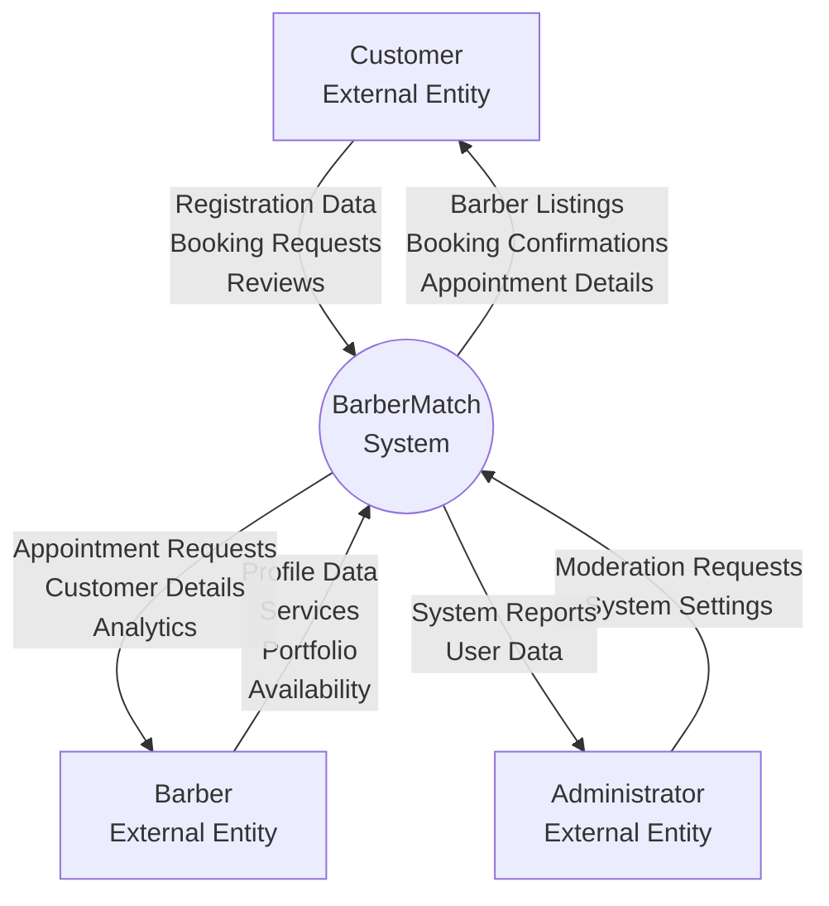
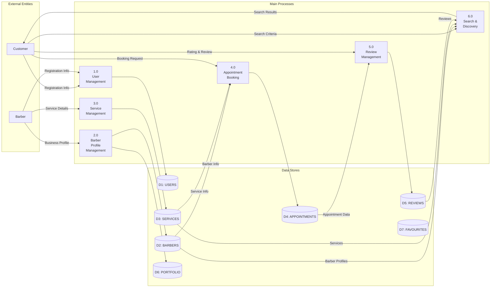
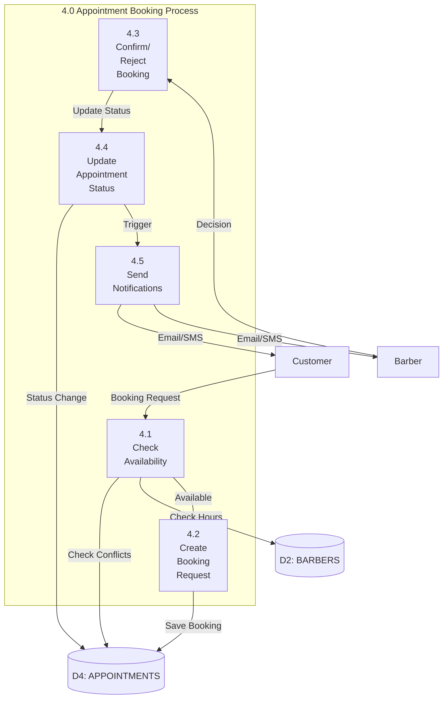

# Phase 2: Database Conceptual Design (ERD)
## Section 2.0 - Data Flow Diagram (DFD) (To-Be)

**Project:** BarberMatch Database System  
**Prepared by:** Shi Ni Lai  
**Date:** January 2026

---

## 2.0 Data Flow Diagram (DFD) (To-Be)

### 2.1 Overview

The Data Flow Diagram illustrates how data flows through the BarberMatch system in the **proposed (To-Be)** state. It shows the transformation from the current manual processes to an automated, database-driven system.

### 2.2 DFD Context Diagram (Level 0)

The context diagram shows the BarberMatch system as a single process with external entities:

### 2.3 DFD Level 1 - Main Processes

### 2.4 Detailed Process Descriptions

#### **Process 1.0: User Management**

**Purpose:** Manage user registration, authentication, and profile updates

**Inputs:**
- Registration data (email, password, name, phone, location, role)
- Login credentials
- Profile update requests

**Outputs:**
- User account confirmation
- Authentication tokens
- Updated profile data

**Data Stores Used:**
- D1: USERS

**Business Rules Applied:**
- RULE-001: Unique email addresses
- RULE-002: Role selection (customer/barber)
- RULE-005: Password strength validation

---

#### **Process 2.0: Barber Profile Management**

**Purpose:** Manage barber business profiles and portfolios

**Inputs:**
- Business profile data (salon name, address, working hours)
- Portfolio images
- Availability updates

**Outputs:**
- Confirmed barber profile
- Portfolio gallery
- Updated availability status

**Data Stores Used:**
- D2: BARBERS
- D6: PORTFOLIO

**Business Rules Applied:**
- RULE-007: Complete business profile required
- RULE-011: Unique salon name per city
- RULE-045: Maximum 20 portfolio images

---

#### **Process 3.0: Service Management**

**Purpose:** Manage service catalog and pricing

**Inputs:**
- Service details (name, description, category, price, duration)
- Service updates
- Activation/deactivation requests

**Outputs:**
- Service confirmation
- Updated service catalog
- Service status changes

**Data Stores Used:**
- D3: SERVICES

**Business Rules Applied:**
- RULE-015: Complete service information required
- RULE-016: Price must be positive
- RULE-017: Duration 15-240 minutes
- RULE-018: Maximum 20 active services

---

#### **Process 4.0: Appointment Booking**

**Purpose:** Process booking requests and manage appointments

**Inputs:**
- Booking requests (customer, barber, service, date, time)
- Confirmation/rejection decisions
- Cancellation requests
- Completion notifications

**Outputs:**
- Booking confirmations
- Appointment status updates
- Availability updates
- Notifications to customers and barbers

**Data Stores Used:**
- D1: USERS
- D2: BARBERS
- D3: SERVICES
- D4: APPOINTMENTS

**Business Rules Applied:**
- RULE-021: Minimum 2 hours advance booking
- RULE-022: Maximum 30 days advance booking
- RULE-024: Within working hours
- RULE-031: No double-booking
- RULE-028/029: Cancellation policies

---

#### **Process 5.0: Review Management**

**Purpose:** Collect and manage customer reviews and ratings

**Inputs:**
- Review submission (rating, review text)
- Flagging requests

**Outputs:**
- Published reviews
- Updated barber ratings
- Review moderation actions

**Data Stores Used:**
- D4: APPOINTMENTS
- D5: REVIEWS
- D2: BARBERS (rating updates)

**Business Rules Applied:**
- RULE-035: Only completed appointments
- RULE-036: One review per appointment
- RULE-037: Within 7 days of completion
- RULE-038: Rating 1-5 stars

---

#### **Process 6.0: Search & Discovery**

**Purpose:** Enable customers to find and filter barbers

**Inputs:**
- Search criteria (location, service type, rating)
- Filter parameters (price range, availability)

**Outputs:**
- Filtered barber listings
- Barber profiles with ratings
- Service details

**Data Stores Used:**
- D2: BARBERS
- D3: SERVICES
- D5: REVIEWS
- D6: PORTFOLIO

**Business Rules Applied:**
- RULE-052: Public data access

---

### 2.5 DFD Level 2 - Appointment Booking (Detailed)

### 2.6 Data Flow Summary

| Data Flow | Source | Destination | Data Elements |
|-----------|--------|-------------|---------------|
| **DF-01** | Customer | Process 1.0 | email, password, name, phone, location |
| **DF-02** | Process 1.0 | D1: USERS | Complete user record |
| **DF-03** | Barber | Process 2.0 | salon_name, address, working_hours, bio |
| **DF-04** | Process 2.0 | D2: BARBERS | Complete barber profile |
| **DF-05** | Barber | Process 3.0 | service_name, price, duration, category |
| **DF-06** | Process 3.0 | D3: SERVICES | Complete service record |
| **DF-07** | Customer | Process 4.0 | barber_id, service_id, date, time |
| **DF-08** | D2: BARBERS | Process 4.0 | working_hours, availability |
| **DF-09** | D3: SERVICES | Process 4.0 | price, duration |
| **DF-10** | Process 4.0 | D4: APPOINTMENTS | Complete appointment record |
| **DF-11** | D4: APPOINTMENTS | Process 5.0 | Completed appointment data |
| **DF-12** | Customer | Process 5.0 | rating, review_text |
| **DF-13** | Process 5.0 | D5: REVIEWS | Complete review record |
| **DF-14** | Customer | Process 6.0 | search_criteria, filters |
| **DF-15** | D2, D3, D5 | Process 6.0 | Barber profiles, services, reviews |
| **DF-16** | Process 6.0 | Customer | Filtered search results |

### 2.7 Comparison: AS-IS vs TO-BE

| Aspect | AS-IS (Manual) | TO-BE (Database-Driven) |
|--------|----------------|------------------------|
| **Booking Process** | Phone calls, manual calendar | Online booking, automated conflict check |
| **Data Storage** | Paper notebooks, scattered files | Centralized database with backups |
| **Availability Check** | Manual phone calls | Real-time availability query |
| **Service Discovery** | Word-of-mouth, phone calls | Searchable database with filters |
| **Reviews** | Informal social media | Structured review system |
| **Analytics** | Manual calculations | Automated reporting queries |
| **Data Integrity** | High error rate | Enforced business rules |
| **Response Time** | 15-20 minutes | < 2 seconds |

---

**Previous:** [Section 1.0 - Introduction](P2_Section_1_Introduction.md)  
**Next:** [Section 3.0 - Data & Transaction Requirements](P2_Section_3_Data_Requirements.md)
