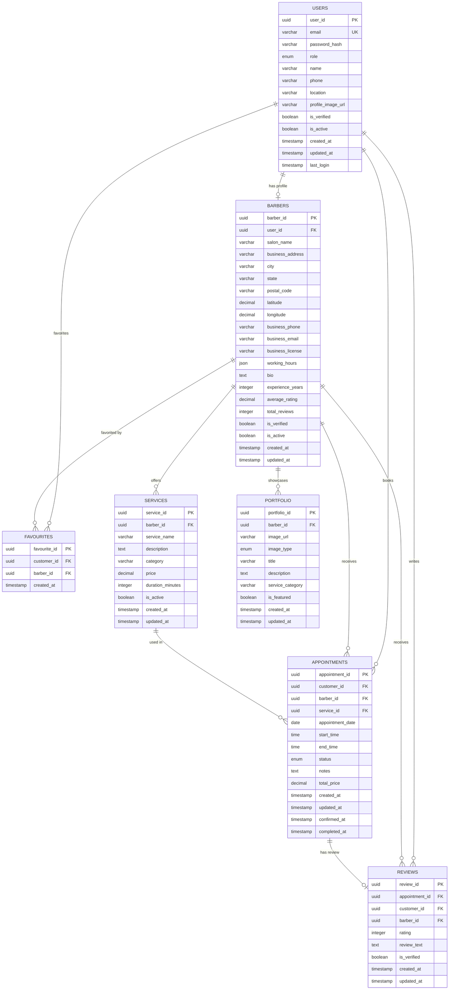

# Phase 2: Database Conceptual Design (ERD)
## Section 4.0 - Database Conceptual Design

**Project:** BarberMatch Database System  
**Prepared by:** Shi Ni Lai  
**Date:** January 2026

---

## 4.0 Database Conceptual Design

### 4.1 Conceptual ERD

The Conceptual Entity-Relationship Diagram presents all entities, their attributes, and relationships in the BarberMatch database system.

#### 4.1.1 Entity Definitions

##### **Entity 1: USERS**

**Purpose:** Store all user accounts (customers and barbers)

| Attribute | Data Type | Constraints | Description |
|-----------|-----------|-------------|-------------|
| **user_id** | UUID | PK, NOT NULL | Unique user identifier |
| email | VARCHAR(255) | UNIQUE, NOT NULL | User email address |
| password_hash | VARCHAR(255) | NOT NULL | Hashed password |
| role | ENUM('customer', 'barber') | NOT NULL | User role |
| name | VARCHAR(100) | NOT NULL | Full name |
| phone | VARCHAR(20) | NOT NULL | Phone number |
| location | VARCHAR(255) | NOT NULL | User location |
| profile_image_url | VARCHAR(500) | NULL | Profile photo URL |
| is_verified | BOOLEAN | DEFAULT false | Email verification status |
| is_active | BOOLEAN | DEFAULT true | Account active status |
| created_at | TIMESTAMP | NOT NULL | Account creation timestamp |
| updated_at | TIMESTAMP | NOT NULL | Last update timestamp |
| last_login | TIMESTAMP | NULL | Last login timestamp |

---

##### **Entity 2: BARBERS**

**Purpose:** Store barber business profiles

| Attribute | Data Type | Constraints | Description |
|-----------|-----------|-------------|-------------|
| **barber_id** | UUID | PK, NOT NULL | Unique barber identifier |
| user_id | UUID | FK (USERS), NOT NULL, UNIQUE | Reference to user account |
| salon_name | VARCHAR(100) | NOT NULL | Business name |
| business_address | VARCHAR(255) | NOT NULL | Physical address |
| city | VARCHAR(50) | NOT NULL | City |
| state | VARCHAR(50) | NOT NULL | State/Province |
| postal_code | VARCHAR(20) | NOT NULL | Postal code |
| latitude | DECIMAL(10,8) | NULL | GPS latitude |
| longitude | DECIMAL(11,8) | NULL | GPS longitude |
| business_phone | VARCHAR(20) | NOT NULL | Business phone |
| business_email | VARCHAR(255) | NULL | Business email |
| business_license | VARCHAR(100) | NULL | License number |
| working_hours | JSON | NOT NULL | Operating hours |
| bio | TEXT | NULL | Barber biography |
| experience_years | INTEGER | DEFAULT 0 | Years of experience |
| average_rating | DECIMAL(3,2) | DEFAULT 0.00 | Average customer rating |
| total_reviews | INTEGER | DEFAULT 0 | Total review count |
| is_verified | BOOLEAN | DEFAULT false | Business verification status |
| is_active | BOOLEAN | DEFAULT true | Profile active status |
| created_at | TIMESTAMP | NOT NULL | Profile creation timestamp |
| updated_at | TIMESTAMP | NOT NULL | Last update timestamp |

**Unique Constraint:** (salon_name, city)

---

##### **Entity 3: SERVICES**

**Purpose:** Catalog of services offered by barbers

| Attribute | Data Type | Constraints | Description |
|-----------|-----------|-------------|-------------|
| **service_id** | UUID | PK, NOT NULL | Unique service identifier |
| barber_id | UUID | FK (BARBERS), NOT NULL | Reference to barber |
| service_name | VARCHAR(100) | NOT NULL | Service name |
| description | TEXT | NULL | Service description |
| category | VARCHAR(50) | NOT NULL | Service category |
| price | DECIMAL(10,2) | NOT NULL, CHECK (price > 0) | Service price |
| duration_minutes | INTEGER | NOT NULL, CHECK (15-240) | Service duration |
| is_active | BOOLEAN | DEFAULT true | Service availability status |
| created_at | TIMESTAMP | NOT NULL | Service creation timestamp |
| updated_at | TIMESTAMP | NOT NULL | Last update timestamp |

---

##### **Entity 4: APPOINTMENTS**

**Purpose:** Booking records and appointment scheduling

| Attribute | Data Type | Constraints | Description |
|-----------|-----------|-------------|-------------|
| **appointment_id** | UUID | PK, NOT NULL | Unique appointment identifier |
| customer_id | UUID | FK (USERS), NOT NULL | Reference to customer |
| barber_id | UUID | FK (BARBERS), NOT NULL | Reference to barber |
| service_id | UUID | FK (SERVICES), NOT NULL | Reference to service |
| appointment_date | DATE | NOT NULL | Appointment date |
| start_time | TIME | NOT NULL | Start time |
| end_time | TIME | NOT NULL | End time |
| status | ENUM | DEFAULT 'requested' | Appointment status |
| notes | TEXT | NULL | Customer notes |
| total_price | DECIMAL(10,2) | NOT NULL | Total cost |
| created_at | TIMESTAMP | NOT NULL | Booking creation timestamp |
| updated_at | TIMESTAMP | NOT NULL | Last update timestamp |
| confirmed_at | TIMESTAMP | NULL | Confirmation timestamp |
| completed_at | TIMESTAMP | NULL | Completion timestamp |

**Status Values:** 'requested', 'confirmed', 'rejected', 'cancelled', 'completed'

**Unique Constraint:** (barber_id, appointment_date, start_time)

---

##### **Entity 5: REVIEWS**

**Purpose:** Customer feedback and barber ratings

| Attribute | Data Type | Constraints | Description |
|-----------|-----------|-------------|-------------|
| **review_id** | UUID | PK, NOT NULL | Unique review identifier |
| appointment_id | UUID | FK (APPOINTMENTS), NOT NULL, UNIQUE | Reference to appointment |
| customer_id | UUID | FK (USERS), NOT NULL | Reference to customer |
| barber_id | UUID | FK (BARBERS), NOT NULL | Reference to barber |
| rating | INTEGER | NOT NULL, CHECK (1-5) | Star rating |
| review_text | TEXT | NULL | Review comments |
| is_verified | BOOLEAN | DEFAULT true | Verified purchase status |
| created_at | TIMESTAMP | NOT NULL | Review submission timestamp |
| updated_at | TIMESTAMP | NOT NULL | Last update timestamp |

---

##### **Entity 6: PORTFOLIO**

**Purpose:** Barber work showcase images

| Attribute | Data Type | Constraints | Description |
|-----------|-----------|-------------|-------------|
| **portfolio_id** | UUID | PK, NOT NULL | Unique portfolio image identifier |
| barber_id | UUID | FK (BARBERS), NOT NULL | Reference to barber |
| image_url | VARCHAR(500) | NOT NULL | Image storage URL |
| image_type | ENUM('before', 'after', 'gallery') | NOT NULL | Image category |
| title | VARCHAR(100) | NULL | Image title |
| description | TEXT | NULL | Image description |
| service_category | VARCHAR(50) | NULL | Related service category |
| is_featured | BOOLEAN | DEFAULT false | Featured image flag |
| created_at | TIMESTAMP | NOT NULL | Upload timestamp |
| updated_at | TIMESTAMP | NOT NULL | Last update timestamp |

---

##### **Entity 7: FAVOURITES**

**Purpose:** Customer favorite barber lists

| Attribute | Data Type | Constraints | Description |
|-----------|-----------|-------------|-------------|
| **favourite_id** | UUID | PK, NOT NULL | Unique favorite identifier |
| customer_id | UUID | FK (USERS), NOT NULL | Reference to customer |
| barber_id | UUID | FK (BARBERS), NOT NULL | Reference to barber |
| created_at | TIMESTAMP | NOT NULL | Favorite creation timestamp |

**Unique Constraint:** (customer_id, barber_id)

---

#### 4.1.2 Conceptual ERD Diagram



---

### 4.2 Enhanced ERD (EERD)

The Enhanced ERD incorporates advanced database features including specialization, generalization, and aggregation.

#### 4.2.1 Enhanced Features

**Feature 1: Specialization (Generalization)**

The USERS entity is specialized into CUSTOMERS and BARBERS based on the `role` attribute:

```
         USERS (Superclass)
           |
    role attribute
    /            \
CUSTOMERS      BARBERS (Subclasses)
(role='customer')  (role='barber')
```

- **Inheritance Type:** Overlapping (a user cannot be both customer and barber simultaneously)
- **Constraint:** Disjoint constraint enforced by `role` ENUM
- **Implementation:** BARBERS table has 1:1 relationship with USERS where `role='barber'`

**Feature 2: Weak Entity**

FAVOURITES is a weak entity dependent on both USERS and BARBERS:

- **Owner Entities:** USERS (customer) and BARBERS
- **Identifying Relationship:** Existence depends on both entities
- **Partial Key:** The combination (customer_id, barber_id) uniquely identifies favorites

**Feature 3: Multi-valued Attribute**

BARBERS.working_hours is stored as JSON to represent multiple day-time combinations:

```json
{
  "monday": {"start": "09:00", "end": "18:00"},
  "tuesday": {"start": "09:00", "end": "18:00"},
  "wednesday": {"closed": true},
  ...
}
```

**Feature 4: Derived Attributes**

- **BARBERS.average_rating** - Calculated from REVIEWS.rating
- **BARBERS.total_reviews** - Count of reviews for the barber
- These are stored for performance but can be recalculated

**Feature 5: Composite Attributes**

Address in BARBERS is composite:
- business_address (street)
- city
- state
- postal_code
- latitude, longitude (geographic coordinates)

#### 4.2.2 Enhanced ERD Diagram

```mermaid
erDiagram
    USERS ||--o| BARBER_PROFILE : "specializes to"
    USERS ||--o{ CUSTOMER_APPOINTMENTS : "creates"
    BARBER_PROFILE ||--o{ BARBER_APPOINTMENTS : "receives"
    BARBER_PROFILE ||--o{ SERVICES : "provides"
    SERVICES ||--o{ APPOINTMENTS : "included in"
    APPOINTMENTS ||--o| REVIEWS : "generates"
    BARBER_PROFILE ||--o{ PORTFOLIO : "maintains"
    USERS }o--o{ BARBER_PROFILE : "FAVOURITES (weak entity)"
    
    USERS {
        uuid user_id PK "Identity"
        varchar email UK "Contact"
        varchar password_hash "Security"
        enum role "Specialization Discriminator"
        varchar name "Profile"
        varchar phone "Contact"
        varchar location "Profile"
        varchar profile_image_url "Visual"
        boolean is_verified "Status"
        boolean is_active "Status"
        timestamp created_at "Audit"
        timestamp updated_at "Audit"
    }
    
    BARBER_PROFILE {
        uuid barber_id PK
        uuid user_id FK "ISA relationship"
        varchar salon_name "Business Identity"
        varchar business_address "Composite Address Line 1"
        varchar city "Composite Address Part"
        varchar state "Composite Address Part"
        varchar postal_code "Composite Address Part"
        decimal latitude "Geographic Coordinate"
        decimal longitude "Geographic Coordinate"
        json working_hours "Multi-valued Attribute"
        text bio "Profile"
        integer experience_years "Profile"
        decimal average_rating "Derived Attribute"
        integer total_reviews "Derived Attribute"
    }
    
    SERVICES {
        uuid service_id PK
        uuid barber_id FK
        varchar service_name
        decimal price "CHECK price > 0"
        integer duration_minutes "CHECK 15-240"
        varchar category "Categorization"
    }
    
    APPOINTMENTS {
        uuid appointment_id PK
        uuid customer_id FK
        uuid_barber_id FK
        uuid service_id FK
        date appointment_date "Temporal"
        time start_time "Temporal"
        time end_time "Temporal"
        enum status "Workflow State"
        decimal total_price "Derived from service"
    }
    
    REVIEWS {
        uuid review_id PK
        uuid appointment_id FK "Strong dependency"
        integer rating "CHECK 1-5 constraint"
        text review_text
    }
    
    PORTFOLIO {
        uuid portfolio_id PK
        uuid barber_id FK
        varchar image_url
        enum image_type "Categorization"
        boolean is_featured "Selection criterion"
    }
```

#### 4.2.3 UML Class Diagram Notation

```
┌─────────────────────────────────┐
│         <<entity>>              │
│           USERS                 │
├─────────────────────────────────┤
│ + user_id: UUID {PK}           │
│ + email: VARCHAR {UK}           │
│ + role: ENUM                    │
│ + name: VARCHAR                 │
│ + phone: VARCHAR                │
│ + is_verified: BOOLEAN          │
│ + is_active: BOOLEAN            │
├─────────────────────────────────┤
│ + register()                    │
│ + login()                       │
│ + updateProfile()               │
└─────────────────────────────────┘
           △
           │ ISA (specialization)
           │
    ┌──────┴──────┐
    │             │
┌───▼────┐   ┌───▼────────────────────┐
│CUSTOMER│   │   <<entity>>           │
└────────┘   │     BARBERS            │
             ├────────────────────────┤
             │ + barber_id: UUID {PK} │
             │ + user_id: UUID {FK}   │
             │ + salon_name: VARCHAR  │
             │ + working_hours: JSON  │
             │ + average_rating*      │
             │   (derived)            │
             ├────────────────────────┤
             │ + addService()         │
             │ + confirmBooking()     │
             │ + updateAvailability() │
             └────────────────────────┘
                      │
                      │ 1
                      │
                      │ *
             ┌────────▼────────┐
             │  <<entity>>     │
             │    SERVICES     │
             ├─────────────────┤
             │+ service_id{PK} │
             │+ barber_id {FK} │
             │+ price {>0}     │
             │+ duration {15-240}│
             └─────────────────┘
```

---

### 4.3 Relationship Summary

| Relationship | Cardinality | Type | Description |
|--------------|-------------|------|-------------|
| USERS → BARBERS | 1:1 | Identifying | One user has one barber profile |
| BARBERS → SERVICES | 1:N | Standard | One barber offers many services |
| USERS → APPOINTMENTS | 1:N | Standard | One customer books many appointments |
| BARBERS → APPOINTMENTS | 1:N | Standard | One barber receives many appointments |
| SERVICES → APPOINTMENTS | 1:N | Standard | One service used in many appointments |
| APPOINTMENTS → REVIEWS | 1:1 | Identifying | One appointment has one review |
| BARBERS → PORTFOLIO | 1:N | Standard | One barber has many portfolio images |
| USERS → FAVOURITES | 1:N | Weak Entity | Customer favorites many barbers |
| BARBERS → FAVOURITES | 1:N | Weak Entity | Barber favorited by many customers |

---

**Previous:** [Section 3.0 - Data & Transaction Requirements](P2_Section_3_Data_Requirements.md)  
**Next:** [Section 5.0 - Data Dictionary](P2_Section_5_Data_Dictionary.md)
